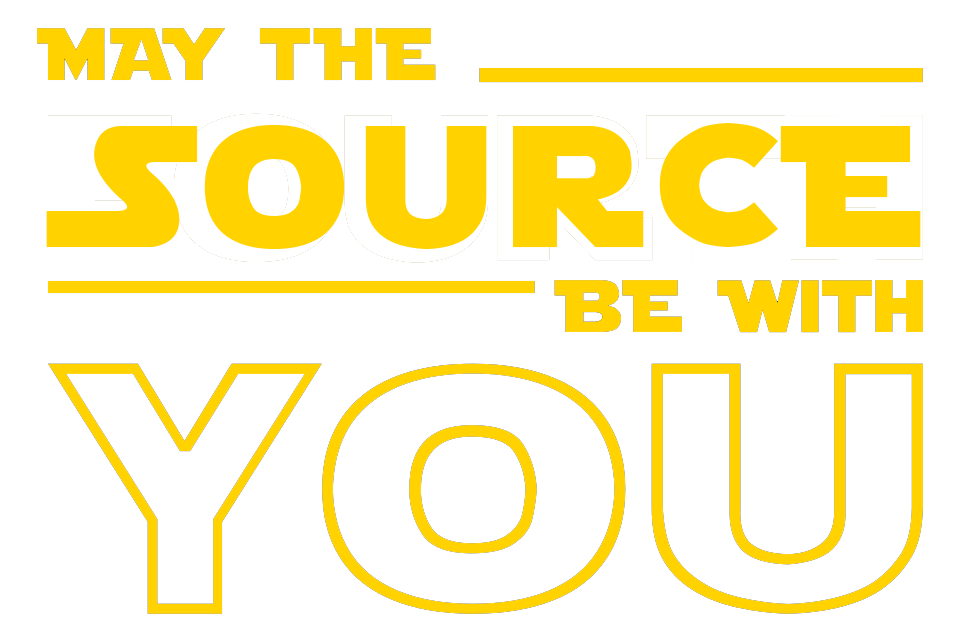

<h1 align="center">Hello There  I'm Oğuzcan Turan</h1>

<h2>🕶 About Me</h2> 

I am currently working as a `Machine Learning Engineer` at `TURK AI`

I graduated from the `Computer Engineering` Department of the University of the Turkish Aeronautical Association as an `Honorary Student`.

I have `ranked` projects in different events and competitions.

I enjoy supporting `entrepreneurial` people like myself.

 

<h2>⚙️ GitHub Analytics</h2>

  
  <!---
  
  --->

<h2>🔥 Some of My Projects</h2> 

 
  

  
  
  

 

by the way..

  

  

