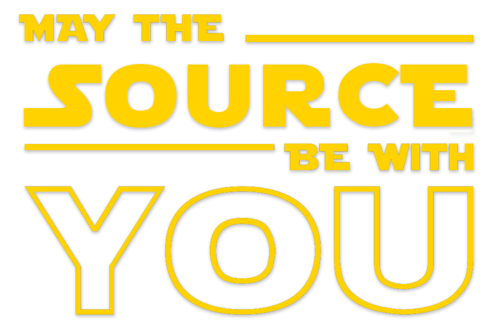

<h1 align="center">Hello There  I'm
 Oğuzcan Turan</h1>

<h2>🕶 About Me</h2>

Creative `Machine Learning Engineer` with 3+ years’ experience working in `Computer Vision` and `Natural Language Processing`.

 

<h2>⚙️ GitHub Analytics</h2>

 
 <!-- -
  
  - -->

<h2>🔥 Some of My Projects</h2>

 
 
 
 
 
 
 
 
 

 
 
 
 

 

 by the way..
 

  

   
  

  

   
  

